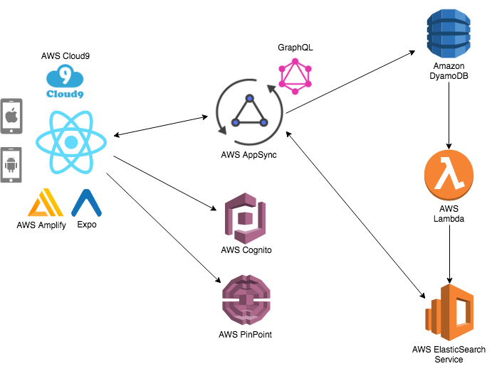
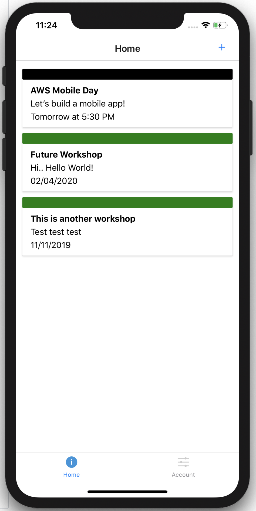
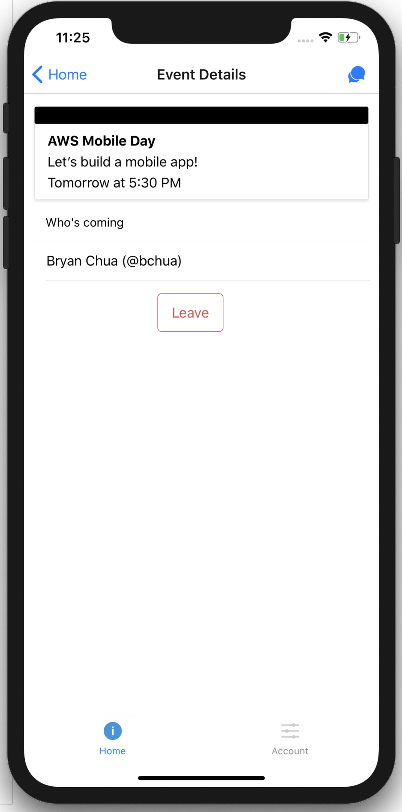
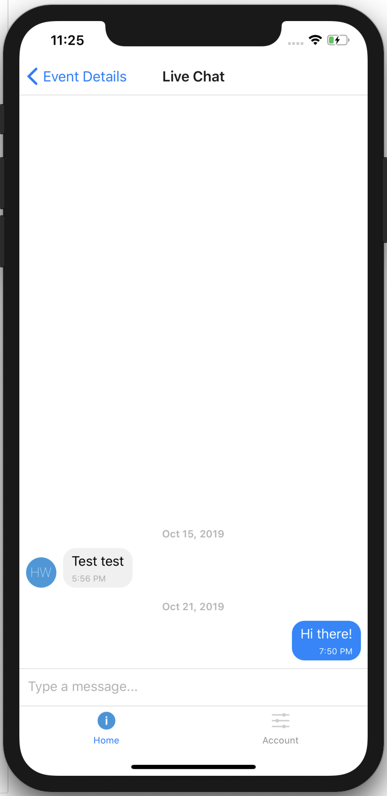

# React Native The AWSome Way!

This is a self-paced workshop designed for developers who want to build a React Native mobile application using mobile services from Amazon Web Services (AWS).

## Reference Architecture

Our application allow users to create meetups and also to join existing meetups. Each meetup has also a chat feature to let users discuss about the event.

### Screenshots

The data model will consist of:

- **Users**: a list of users who are using the app
- **Events**: a list of events created by the users in the app
- **Chats**: a list of chat messages created in the event by users
- **EventUserJoined**: a joint table between users and events to indicate who is joining which events

