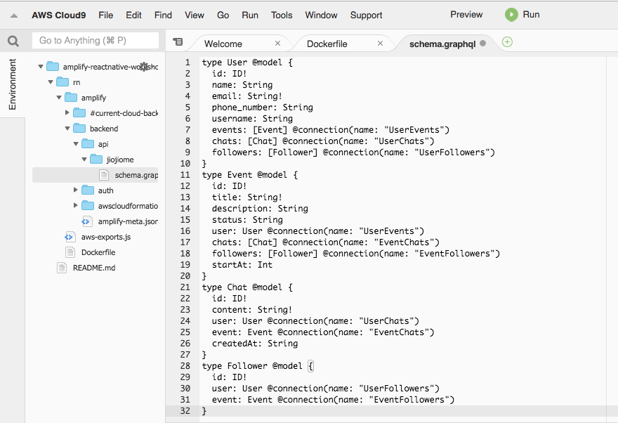

# AppSync

AWS AppSync automatically updates the data in web and mobile applications in real time, and updates data for offline users as soon as they reconnect. AWS AppSync makes it easy to build collaborative mobile and web applications that deliver responsive, collaborative user experiences.


## Table of Contents

- [Create AppSync API](#create-appsync-api)
- [Edit your GraphQL Schema](#edit-your-graphql-schema)
- [Enable Analytics to your mobile app](#enable-analytics-to-your-mobile-apps)

## Create AppSync API

```
amplify api add
```

At this point, you will see either GraphQL or REST. In this lab, we will create the AWS AppSync by selecting GraphQL.

```
? Please select from one of the below mentioned services (Use arrow keys)
❯ GraphQL
  REST
```

Enter the API name: `eventapp`

At this point, choose `Amazon Cognito User Pool` as your autorization type for this API.

Select 'N' as you do not have an anootated GraphQL schema yet.

Select 'Y' for guided schema creation and edit the schema now. You should see:

```
? Do you have an annotated GraphQL schema? No
? Do you want a guided schema creation? true
? What best describes your project: (Use arrow keys)
? What best describes your project: Single object with fields (e.g., “Todo” with ID, name, description)
? Do you want to edit the schema now? (Y/n)
? Do you want to edit the schema now? Yes
Please manually edit the file created at /code/amplify/backend/api/eventapp/schema.graphql
```

Go to the schema file and start editing.



Copy the following and replace the schema:

```
type User @model {
  id: ID!
  name: String
  email: String!
  phone_number: String
  username: String
  events: [Event] @connection(name: "UserEvents")
  chats: [Chat] @connection(name: "UserChats")
  followers: [Follower] @connection(name: "UserFollowers")
}
type Event @model {
  id: ID!
  title: String!
  description: String
  user: User @connection(name: "UserEvents")
  chats: [Chat] @connection(name: "EventChats", sortField: "createdAt")
  followers: [Follower] @connection(name: "EventFollowers")
  startAt: Int
}
type Chat @model {
  id: ID!
  content: String!
  user: User @connection(name: "UserChats")
  event: Event @connection(name: "EventChats")
  createdAt: String
}
type Follower @model {
  id: ID!
  user: User @connection(name: "UserFollowers")
  event: Event @connection(name: "EventFollowers")
}
```

Next, saved the file and go back to your Cloud9 terminal, Press `Enter` to continue. You should see the following messages:

```
Successfully added resource XXX locally

Some next steps:
"amplify push" will build all your local backend resources and provision it in the cloud
"amplify publish" will build all your local backend and frontend resources (if you have hosting category added) and provision it in the cloud
```

Enter the following command to see the changes:

```
amplify status
```

You should see:

```
| Category | Resource name   | Operation | Provider plugin   |
| -------- | --------------- | --------- | ----------------- |
| Auth     | cognito742b133c | No Change | awscloudformation |
| Api      | eventapp        | Create    | awscloudformation |
```

Let's now push your changes to the AWS and it will take a few minutes to complete.

```
amplify push
```

## Edit your GraphQL Schema

Once done, let's edit your GraphQL schema to add in one attribute `status`:

```
type Event @model {
  id: ID!
  title: String!
  description: String
  status: String
  user: User @connection(name: "UserEvents")
  chats: [Chat] @connection(name: "EventChats", sortField: "createdAt")
  followers: [Follower] @connection(name: "EventFollowers")
  startAt: Int
}
```

Save the file again to make sure your change is updated.

With the new annotation for the graphql schema, you can easily add @searchable to have the ability of search from Elasticsearch and @auth to make sure only the right user is able to access their own info. In this lab, we will not cover those but you can easily explore [these annotations](https://aws-amplify.github.io/docs/js/api#using-graphql-transformers) after this workshop at your own pace.

Enter the following command to push your changes to the AWS.

```
amplify push
```

You should begin to see the following:

```
GraphQL schema compiled successfully.
Edit your schema at /Volumes/Data/Git/aws-amplify-app/amplify/backend/api/awsamplifyapp/schema.graphql or place .graphql files in a directory at /Volumes/Data/Git/aws-amplify-app/amplify/backend/api/awsamplifyapp/schema
```

Since we are providing you the app, you do not need to generate code for your GraphQL API. Enter `Y` and continue.

```
? Do you want to generate code for your newly created GraphQL API (Y/n) Y
```

Now, you can wait for the resources in the terminal.

```
⠸ Updating resources in the cloud. This may take a few minutes...
```

Until you see the success message in the following:

```
✔ All resources are updated in the cloud
```

## Enable Analytics to your mobile app

Before you move to the next lab, you are going to add **Analytics** to increase your app visibility & understand your users better.

```
amplify add analytics
```

Enter your app name below:

```
? Provide your pinpoint resource name: (eventapp)
```

Enter 'Y' to enable Analytics for any users. You would want to do this because you can further analyze where are the dropoffs for customer registration / sign up process.

```
Adding analytics would add the Auth category to the project if not already added.
? Apps need authorization to send analytics events. Do you want to allow guests and unauthenticated users to send analyti
cs events? (we recommend you allow this when getting started) (Y/n)
```

Now, you should be able to see the following:

```
Successfully added auth resource locally.
Successfully added resource eventapp locally

Some next steps:
"amplify push" builds all of your local backend resources and provisions them in the cloud
"amplify publish" builds all your local backend and front-end resources (if you have hosting category added) and provisions them in the cloud
```

And now, do another amplify push to add new AWS resource.

```
amplify push
```

Until you see the success message in the following, you can proceed to the next lab.

```
✔ All resources are updated in the cloud
```
