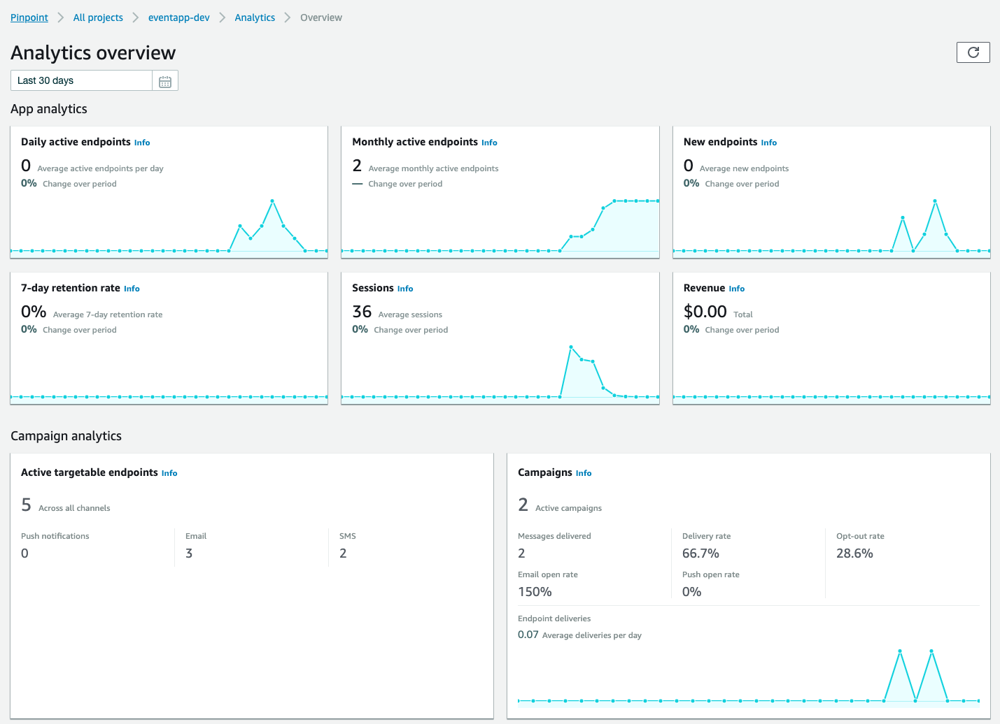
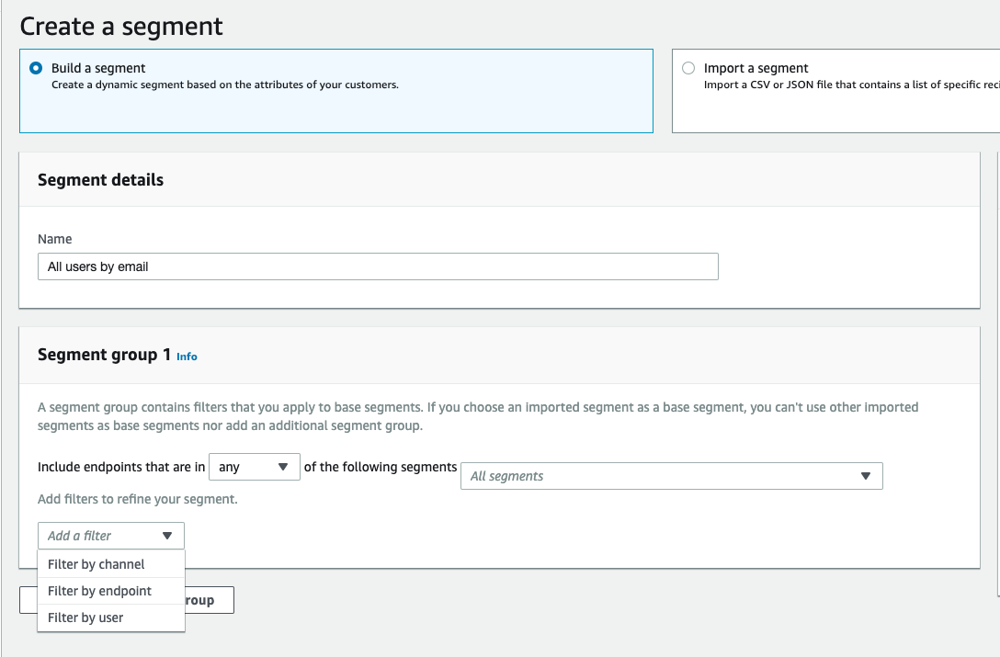
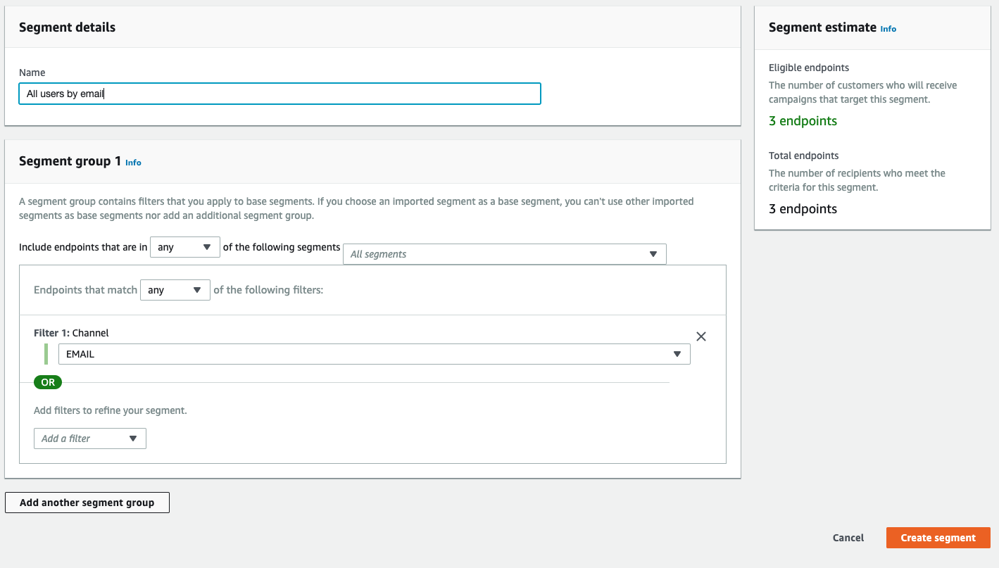
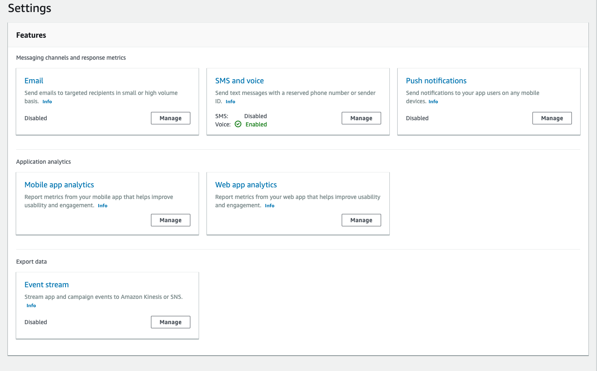
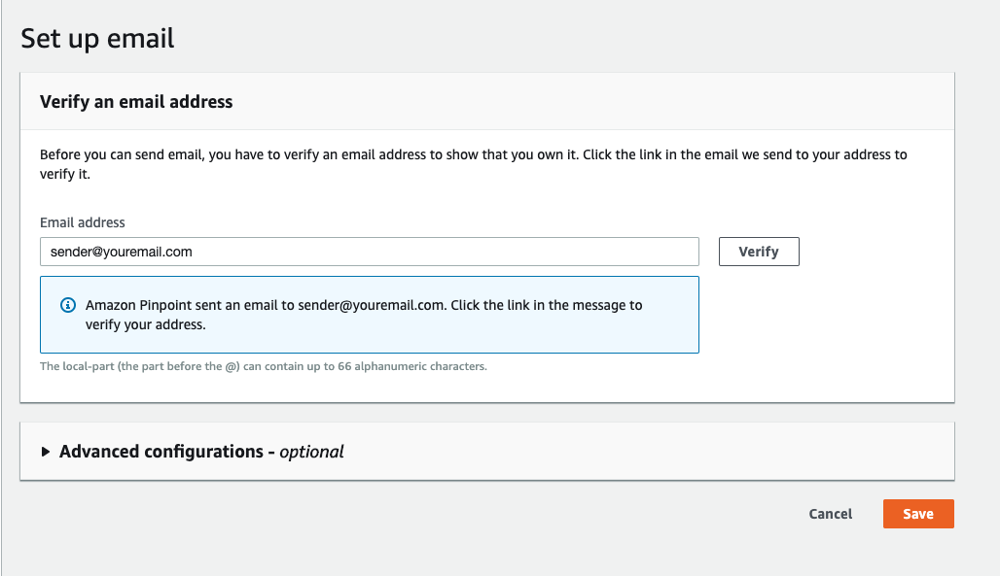
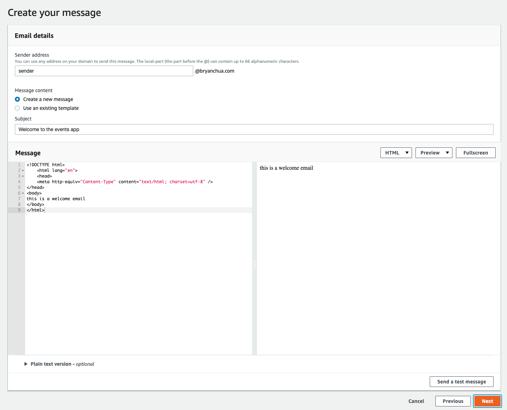

# Amazon Pinpoint

- [Explore Analytics in Amazon Pinpoint](#explore-analytics-in-amazon-pinpoint)
- [Create segment to target specific users](#create-segment-to-target-specific-users)
- [Enable your email channel](#enable-email-channel)
- [Create a camaign for a specific event](#create-a-campaign-for-a-specific-event)

## Explore Analytics in Amazon Pinpoint

1. Go to the [Amazon Pinpoint console](https://console.aws.amazon.com/pinpoint/home?region=us-east-1#/)

2. Select the `eventapp` project. Here you will see the Application Analytics over the last 30 days.

3. Go to `Analytics` to take a look at the App Analytics provided by default

## Create Segment to target specific users

Let's say I want to send an email to all the users who created their first event to thank and remind them what to do. You can do that by first having them in a Segment.

1. Go to **Segments**

2. Select `Create a segment` to create a dynamic segment (a group of users who will meet certain criteria)

3. Give a name `All users by email` to the segment.

4. Under Segment group 1, select `Add a filter` and choose `Filter by Channel`.

5. Now, select the channel `EMAIL`. (Note that you can create more conditions to filter and target specific users)

6. Since you might have use the app in the previous section of the workshop, you can see the Segment estimate on the right.

7. Once confirmed, scroll down (all the way) and click `Create segment`.

## Enable Email Channel

There are various marketing channels that can be used to reach out to the users. We are going to enable `email` as the communication channel to the users.

1. Click on and go to `settings`, select `Email`

2. Under `Project features` and `Email` section, Select `Configure`.

3. Verify _your own email_ to show that you own it and this will be the email used for sending.

4. Now you will need to go your email inbox and find the email that is from AWS (with the title 'Amazon Web Services – Email Address Verification Request in XXX') and click on the verification link given in the email.

5. Once your email is verified, you can now go back to the AWS console (where you previous left off) and click `Save` to enable email channel.

## Create a Campaign for a specific event

In this lab, we are going to welcome all new registered users with an email via a campaign in Amazon Pinpoint.

1. Go to Campaign & select `Create a Campaign` to begin

2. Give a name to your campaign, select `Standard Campaign` and select `Email` channel.

3. Now open up `Edit campaign settings` and edit `Max campaign messages per endpoint`, give it `1`. This means in the entire campaign, only one campaign message will be sent to the user.

4. Scroll down. Click `Next` to proceed.

5. Choose a segment. Select the pre-created segment `All users by email` and click `Next` at bottom right.

6. Draft a welcome email. Give a subject and content to the email.

7. Campaign setup. Select `When an event occurs`, events `loaded` with attributes `Home`. In this lab, the mobile app is already sending custom analytics.

8. Select the Campaign dates to start (minimum) 15 minutes from now.

9. Review and launch (and wait for the campaign to start).

Now, your campaign will be sending emails to all newly registered users.
